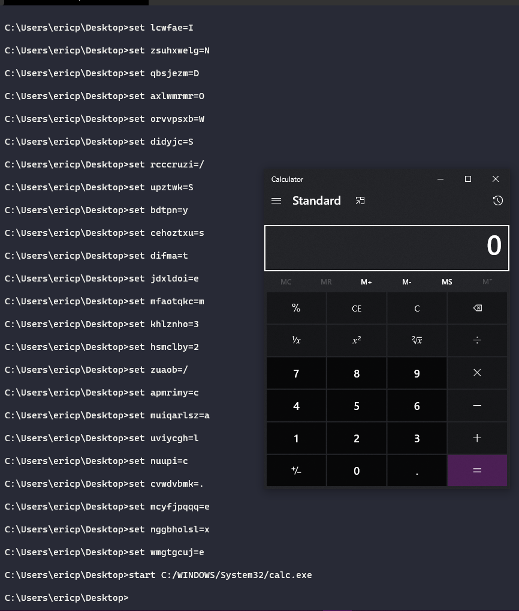
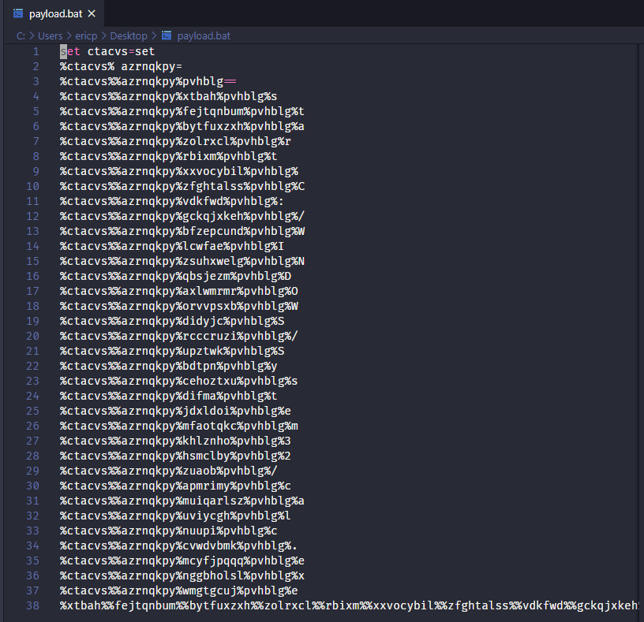
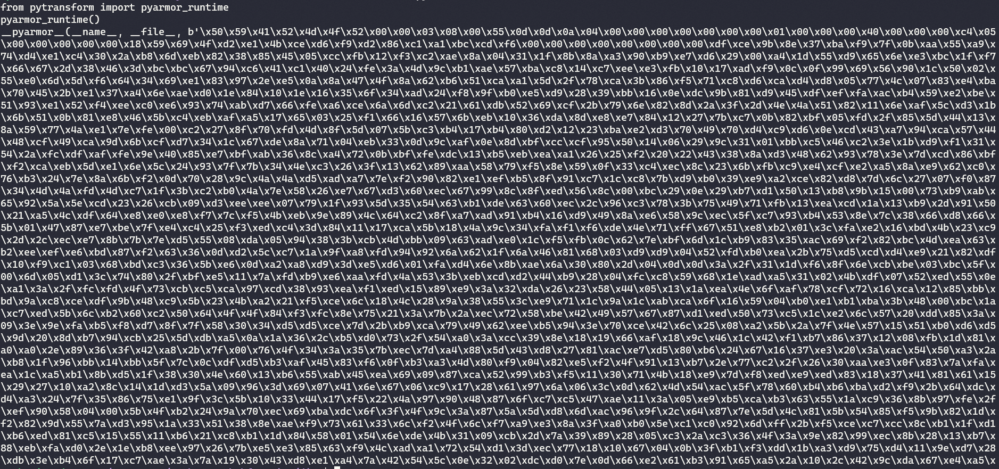

# Python Batch Obscutation
Running this file creates a Windows batch file called "payload.bat". This file will set obfuscated batch variables equal to the `goal` object in the file. It is currently set to launch the calculator as a proof of concept.

### Installation

Just clone the repository and change the 'goal' variable to whichever program you wish to obfuscate. Then run the 'payload.bat' file on a Windows machine. Requires the f-string feature in Python3 to work correctly. 

### Running the Program 

`python3 obfuscate.py`

### .bat Result:

### Additional Ideas 

If you want to obfuscate further, you can edit the obfuscate.py file to your preferences then run a program like [pyarmor](https://pypi.org/project/pyarmor/) on it. The result will be:

